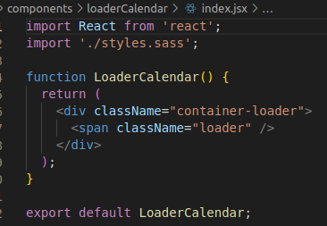
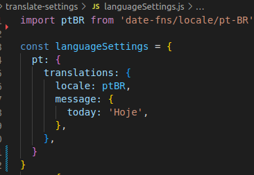

# Simple calendar - Template
- Template for a simple calendar.

## Loader settings
- 
- In this file you will find the loading animation, which can be chaned. PATH (src/components/loaderCallendar)

## translate settings
- 

- In this file you can find the configured languages, which can be changed, the date-fns library is used for date formatting. PATH (src/translate-settings/languageSettings)